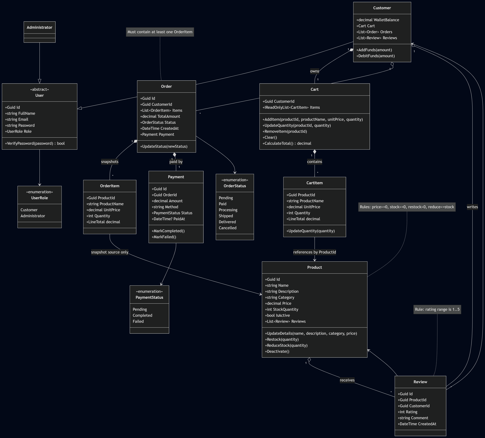

# CommerceConsole

## What Is CommerceConsole?

CommerceConsole is a C# console application for an Online Shopping Backend System.
It implements role-based shopping workflows with layered architecture, domain-centered validation, JSON persistence, and submission-grade test coverage.

## Why Choose CommerceConsole?

- Clear separation of concerns across Presentation, Application, Domain, and Infrastructure layers.
- Centralized workflow orchestration for authentication, catalog, cart, wallet, checkout, orders, reviews, and reporting.
- Persistent mutable data using JSON-backed repositories without database setup overhead.
- Submission 2 pattern implementation with Repository, Strategy, Factory, and Command.
- Demo-friendly user experience with index-based selection flows and no user-facing GUID entry.

# Documentation

## Software Requirement Specification

### Overview

CommerceConsole provides customer and administrator workflows for online shopping operations, including authentication, catalog management, cart/wallet interactions, checkout/order processing, order lifecycle control, reviews, and reporting.

### Components and Functional Requirements (Implemented)

**1. Authentication and authorization management**

- Customer registration.
- Customer and administrator login.
- Role-based routing to customer/admin workspaces.

**2. Product catalog and inventory management**

- Customer browse and search by name/category.
- Administrator add, update, delete, and restock workflows.
- Low-stock visibility and active/inactive product handling.

**3. Cart and wallet subsystem**

- Add/update/remove cart items.
- Quantity validation against stock rules.
- Wallet balance view and wallet top-up.

**4. Checkout, payment, and order processing**

- Wallet-only checkout.
- Stock and wallet validation before purchase.
- Stock deduction, payment creation, order item snapshots, and cart clearing on success.

**5. Order management subsystem**

- Customer order history and status tracking.
- Administrator all-orders view and controlled status updates.

**6. Reviews and reporting subsystem**

- Purchased-product-only review eligibility.
- Rating validation and product average rating.
- Sales reporting: total revenue, orders by status, best sellers, low-stock products.

**7. Quality and persistence**

- Friendly exception handling at presentation boundaries.
- Reusable console input/output helpers.
- JSON persistence for users, products, and orders.

**8. Bonus capabilities implemented**

- PDF sales report export.
- Smart heuristic admin insights.
- Customer recommendations.

## Quality And Testing

- Automated tests cover domain, application, infrastructure, and presentation layers.
- Current local regression baseline (March 9, 2026): `115` tests passed.
- Critical validation and exception pathways are included in regression checks.

## Additional Documentation

- `docs/architecture.md`
- `docs/auth-flow.md`
- `docs/product-catalog.md`
- `docs/cart-wallet.md`
- `docs/checkout-orders.md`
- `docs/order-lifecycle.md`
- `docs/reviews-reporting.md`
- `docs/persistence.md`
- `docs/design-patterns-current.md`
- `docs/test-plan.md`
- `docs/domain-model.md`
- `docs/class-diagram.md`

### Domain Model



# Running Application

## Prerequisites

- .NET 10 SDK

## Navigate To Project Folder

If your terminal is not already in the project directory, run:

```powershell
cd PATH_TO_REPO_FOLDER
```

## Build

```powershell
dotnet build CommerceConsole.csproj
```

## Run

```powershell
dotnet run --project CommerceConsole.csproj
```

## Run Tests

```powershell
dotnet test Tests\CommerceConsole.Tests\CommerceConsole.Tests.csproj
```

## Default Login Details

### Administrator Login

Use the seeded administrator account:

- **Email:** `admin@commerce.local`
- **Password:** `admin123`

### Customer Login

Register a customer account in the application and then log in with those same credentials.
