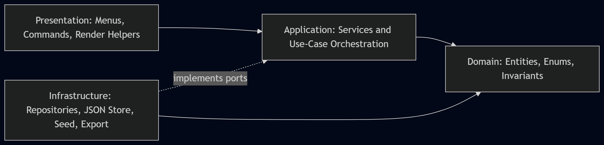

# CommerceConsole

## What Is CommerceConsole?

CommerceConsole is a C# (`.NET 10`) console application for an Online Shopping Backend System.
It delivers complete customer and administrator workflows with a layered architecture, domain-centered business rules, JSON persistence, and strong automated test coverage.

## Why Choose CommerceConsole?

- Clear layered design: `Presentation`, `Application`, `Domain`, and `Infrastructure` are separated.
- Reliable business logic: cart, wallet, checkout, and order lifecycle rules are centrally enforced.
- Submission 2 pattern implementation: `Repository`, `Strategy`, `Factory`, and `Command`.
- Practical persistence: data stored in JSON files with no database setup required.
- Demo-friendly UX: index-based selection flows (no user-facing GUID input).

## Scope And Implemented Capabilities

### Customer Workspace

- Register and log in.
- Browse and search active products.
- Add/update/remove cart items.
- View wallet and top up funds.
- Checkout using wallet payment.
- View order history and tracking.
- Add reviews only for purchased products.
- View recommendation suggestions (bonus).

### Administrator Workspace

- Add, update, delete, and restock products.
- View full catalog and low-stock products.
- View all orders.
- Update order status using valid transitions only.
- View sales report (revenue, statuses, best sellers, low stock).
- View smart insights (bonus).
- Export sales report to PDF (bonus).

### Cross-Cutting Quality

- Centralized validation and domain exceptions.
- Friendly presentation-layer error handling.
- Reusable console helpers for consistent UX.
- JSON-backed repositories for mutable data persistence.

## Architecture At A Glance



## Domain Model


Design notes:
- `Program.cs` is the composition root.
- Menus do not call repositories directly.
- Domain invariants are enforced in constructors/mutator methods.
- Infrastructure maps between domain entities and persistence record models.

## Design Patterns Implemented (Submission 2)

1. **Repository Pattern**
   - Contracts: `IUserRepository`, `IProductRepository`, `IOrderRepository`
   - Implementations: `InMemoryUserRepository`, `InMemoryProductRepository`, `InMemoryOrderRepository`
2. **Strategy Pattern**
   - Payment: `IPaymentStrategy` -> `WalletPaymentStrategy`
   - Export: `IReportExporter` -> `PdfReportExporter`
3. **Factory Pattern**
   - Role routing: `IRoleWorkspaceFactory` -> `RoleWorkspaceFactory`
4. **Command Pattern**
   - Menu dispatch: `IMenuCommand` + `MenuCommandDispatcher`

## Project Structure

```text
CommerceConsole/
  Presentation/
    Menus/
    Commands/
    Helpers/
    Workspaces/
  Application/
    Interfaces/
    Services/
    Models/
  Domain/
    Entities/
    Enums/
    Exceptions/
  Infrastructure/
    Repositories/
      Models/
    Persistence/
    Data/
    Export/
  Tests/
    CommerceConsole.Tests/
      Domain/
      Application/
      Infrastructure/
      Presentation/
  docs/
```

## Persistence Model

Runtime mutable data is persisted to JSON under `data/`:

- `data/users.json`
- `data/products.json`
- `data/orders.json`

Persistence behavior:
- repositories own read/write operations
- record models (`*Record`) isolate storage schema from domain entities
- `JsonFileStore` handles file-based persistence operations

## Testing And Quality Baseline

Latest local regression baseline (**March 9, 2026**):
- Total tests: **115**
- Passed: **115**
- Failed: **0**
- Skipped: **0**

Test coverage spans:
- domain invariants
- application workflows
- infrastructure persistence/export behavior
- presentation command/input helpers

## Documentation Map

- `docs/architecture.md` - architecture boundaries and dependency direction
- `docs/domain-model.md` - detailed domain entities, aggregates, invariants
- `docs/class-diagram.md` - class diagrams (domain, presentation, application/infrastructure)
- `docs/auth-flow.md` - registration/login/session flow
- `docs/product-catalog.md` - product and inventory behavior
- `docs/cart-wallet.md` - cart and wallet rules
- `docs/checkout-orders.md` - checkout orchestration and order creation
- `docs/order-lifecycle.md` - order status transition behavior
- `docs/reviews-reporting.md` - review eligibility and reporting logic
- `docs/persistence.md` - JSON persistence design and mapping
- `docs/design-patterns-current.md` - formal pattern implementation scope
- `docs/test-plan.md` - test strategy, execution, and quality boundaries

## Running The Application

## Prerequisites

- .NET 10 SDK

## Navigate To The Project Folder

If needed:

```powershell
cd PATH_TO_FOLDER
```

## Build

```powershell
dotnet build CommerceConsole.csproj
```

## Run

```powershell
dotnet run --project CommerceConsole.csproj
```

## Run Tests

```powershell
dotnet test Tests\CommerceConsole.Tests\CommerceConsole.Tests.csproj
```

## Seeded Access

### Administrator

- Email: `admin@commerce.local`
- Password: `admin123`

### Customer

- Register a new customer account in the app.
- Log in with the same credentials you registered.
