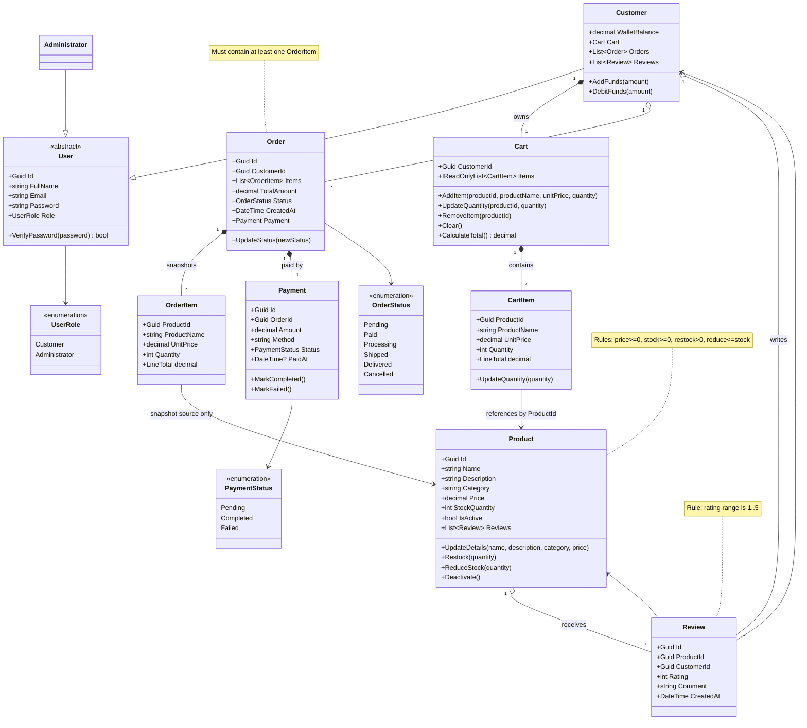

# Domain Model

## Purpose

This document defines the business-domain model for CommerceConsole, including entity relationships, aggregate boundaries, and rule ownership.

## Domain Modeling Approach

CommerceConsole uses a domain-centered model with rich entities and guarded mutations.

Model characteristics:

- entities own business state and behavior
- invariants are enforced in constructors and mutation methods
- workflows in the application layer orchestrate entities, but do not bypass entity rules
- persistence models are kept separate in infrastructure (`*Record` types)

This is DDD-inspired modeling, but not full tactical DDD (no bounded-context split or domain events).

## Core Aggregates And Responsibilities

## 1) Customer Account Aggregate

Aggregate root:

- `Customer`

Owned/associated concepts:

- `Cart` (owned composition)
- wallet balance (owned value state)
- order history references (`List<Order>`)
- review history references (`List<Review>`)

Key rules:

- wallet top-up amount must be greater than zero
- wallet debit amount must be greater than zero and not exceed balance
- cart is always tied to exactly one customer ID

## 2) Catalog Aggregate

Aggregate root:

- `Product`

Owned/associated concepts:

- review collection (`List<Review>`)
- stock and activity state

Key rules:

- product ID must be non-empty GUID
- product name/category required
- price and stock cannot be negative
- restock quantity must be greater than zero
- reduce-stock quantity must be greater than zero and within available stock

## 3) Order Aggregate

Aggregate root:

- `Order`

Owned composition:

- `OrderItem` snapshots
- `Payment`

Key rules:

- order must contain at least one item
- order total is derived from item snapshots
- order status is mutation-controlled through workflow policy
- payment amount must be greater than zero

## Invariant Ownership Matrix

| Entity      | Invariant / Rule                                              | Enforced In                                |
| ----------- | ------------------------------------------------------------- | ------------------------------------------ |
| `User`      | valid ID, required full name/email/password, normalized email | `User` constructor                         |
| `Customer`  | positive top-up, valid debit, sufficient funds                | `Customer.AddFunds`, `Customer.DebitFunds` |
| `Cart`      | valid owner ID, positive add quantity, remove on zero update  | `Cart` constructor and mutation methods    |
| `CartItem`  | valid product ID/name, non-negative price, positive quantity  | `CartItem` constructor/mutator             |
| `Product`   | non-negative price/stock, valid naming, stock safety          | `Product` constructor/mutators             |
| `Order`     | valid IDs, non-empty item list, derived total                 | `Order` constructor                        |
| `OrderItem` | valid snapshot fields, positive quantity                      | `OrderItem` constructor                    |
| `Payment`   | valid IDs, positive amount, method required                   | `Payment` constructor                      |
| `Review`    | valid IDs, rating in range 1..5                               | `Review` constructor                       |

## Detailed Mermaid Domain Model

## Lifecycle Notes

- Cart lifecycle: mutable while shopping; cleared after successful checkout.
- Order lifecycle: created as `Pending`, then moved by workflow policy through valid statuses.
- Payment lifecycle: starts `Pending`, then set to `Completed` or `Failed`.
- Product lifecycle: active by default; can be deactivated and remains in admin-managed catalog state.

## Why This Model Supports Maintainability

- Invariants are protected at entity boundaries, reducing invalid runtime states.
- Snapshot-based `OrderItem` prevents historical order corruption when product catalog data changes.
- Composition in `Cart` and `Order` keeps high-cohesion domains easy to test.
- Separation from infrastructure record models allows persistence schema changes with lower domain risk.
